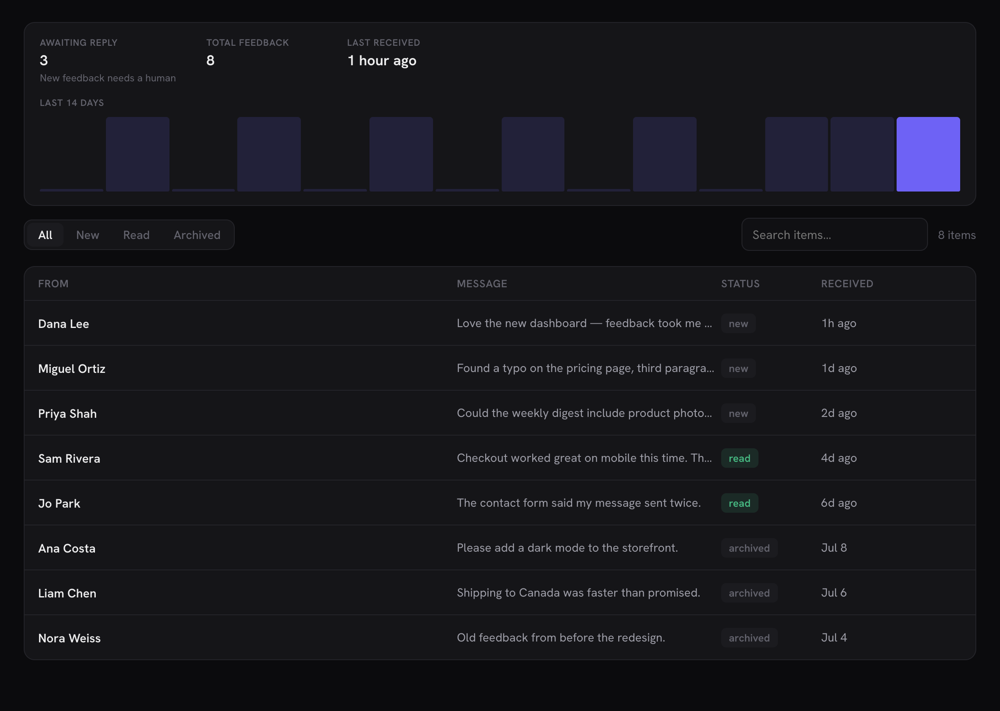

# The shim tutorial — a custom-table plugin, wired into Minn

Most plugins that would benefit from a Minn surface keep their data in a
custom database table: form entries, email logs, redirects, queue rows. Core
REST knows nothing about those tables, so the integration is two parts:

1. **a REST shim** — a few small routes that translate "rows in my table"
   into JSON, and
2. **a surface descriptor** — pure data telling Minn how to render it.

This walkthrough builds both for a fictional plugin, start to finish. The
finished code is a real, working plugin you can copy:
[`docs/examples/minn-example-adapter/`](examples/minn-example-adapter/minn-example-adapter.php).
Drop it into `wp-content/plugins/`, activate it next to Minn Admin, and a
**Feedback** view appears in the sidebar with a status card, tabs, search, a
detail modal and row actions. Every section below is numbered to match the
comments in that file. (It is also exercised by Minn's own test suite —
`tests/example-adapter.test.js` — so if the contract ever changes, the
example breaks in CI before it breaks under you.)

The fiction: **Campfire** collects visitor feedback into
`{prefix}campfire_feedback` — id, name, email, message, a status
(`new` / `read` / `archived`), and a UTC `created_at`.

## Step 0 — where the code lives

One file inside your own plugin, loaded unconditionally:

```php
require_once __DIR__ . '/includes/minn-admin.php';
```

Everything in it is `add_filter` / `register_rest_route` calls: with Minn
absent the filter never fires and the routes just sit there — a free no-op.
No `class_exists( 'Minn_Admin' )` guard needed. (The example plugin is
single-file only because it's a tutorial.)

## Step 1 — the data (one decision that matters)

The table itself is whatever your plugin already has. The one choice worth
making deliberately: **store timestamps in UTC** (`gmdate`, not
`current_time`). Minn renders relative times ("2 hours ago") in the
visitor's timezone, and it needs to know what it's parsing. Bare datetimes
are assumed site-local; a `utc: true` flag on the column (step 4) declares
otherwise. The classic shim bug is storing UTC and letting it render as
site-local — every timestamp shifts by the site's offset and nobody notices
until a log entry appears to come from the future.

## Step 2 — one capability helper

```php
function campfire_can() {
	return current_user_can( 'edit_posts' );
}
```

Minn checks the descriptor's `cap` before the surface exists in the app at
all — but that is UI gating, a convenience. **Your routes' own
`permission_callback` is the boundary.** Centralize the answer in one
function so the two can never disagree, and swap the body for your plugin's
real capability model (a granular cap, an option-driven role check, your
own resolver). If your plugin has its own access settings — "only these
roles may see submissions" — route through them here, the way the bundled
WP Activity Log adapter routes through that plugin's own
`Settings_Helper::current_user_can()`.

## Step 3 — the REST shim

Five small routes. The shapes Minn consumes:

| Route | Returns |
|---|---|
| `GET /feedback` | `{ "items": [...], "total": 123 }` — the list |
| `GET /feedback/{id}` | one item — the detail modal |
| `POST /feedback/{id}/read` | `{ "message": "Marked as read" }` — an action |
| `POST /feedback/{id}/archive` | same shape — a second action |
| `GET /feedback/status` | the status card model |

Rules that keep a shim safe, all visible in the example file:

- **Every route declares `permission_callback`.** Never `__return_true` for
  private data. (Minn's System page flags plugins that skip this.)
- **Every query goes through `$wpdb->prepare`.** The search input is a
  visitor-typed string headed into SQL: `esc_like` + placeholders, no
  exceptions.
- **Cap `per_page`.** Minn asks for 25; a hand-crafted request should not be
  able to ask for a million.
- **Never `unserialize()` stored blobs.** Not needed for Campfire, but the
  rule that bites real log tables: if an old row holds a PHP-serialized
  value, parse it with a regex or `json_decode` — a crafted blob must never
  reach `unserialize()`.

The list route reads three inputs Minn sends: `page` (plus whatever your
`pageQuery` template names, here `per_page`), the active tab's value (here
the `status` param, declared in step 4), and the debounced `search` term.
It answers `{ items, total }`; the descriptor's `itemsKey` / `totalKey`
point Minn at both. Standard WP-style collections (plain array +
`X-WP-Total` header) skip those two keys entirely.

Shape each row in one function (`campfire_item()` in the example) so the
list and detail routes can never drift apart.

Action routes do their one write through your plugin's own code path and
may return `{ "message": "…" }` — that string replaces Minn's default
"⟨label⟩ — done" toast, which is the honest channel when the outcome needs
more words than the button label promised.

The status route returns **display-ready strings** — Minn renders the card,
your server does the formatting (counts, `human_time_diff`, currency,
whatever). An optional `chart` key draws a daily bar series in the same
visual language as Minn's Overview charts.

## Step 4 — the descriptor

Pure data on one filter. No callbacks reach the client (`setup` callables
are evaluated server-side), no JavaScript ships, and Minn escapes every
value it renders — never pre-escape.

```php
add_filter( 'minn_admin_surfaces', 'campfire_surface' );
```

Walking the choices in the example's descriptor:

- **`cap`** — mirrors `campfire_can()` (step 2).
- **`group: 'workspace'`** — Campfire is inbox-shaped: new items arrive and
  need a human. That is the bar for Workspace placement. Logs, redirects
  and plumbing belong in the default Tools group; users can hide any
  surface they disagree with (and there is no API to resist it).
- **`tabs`** — the static form: a `param` plus `[value, label]` pairs. Minn
  appends `status=new` to the list request for the New tab and omits the
  param for All. (The `{tab}`-in-route form exists for APIs like Gravity
  Forms whose tab is a path segment.)
- **`search: 'search={q}'`** — a query-string template. The object form of
  `search` is only for APIs that take JSON criteria strings; if your route
  reads a plain param, use the template.
- **`columns`** — note `format: 'pill'` on status and `format: 'ago'` with
  **`utc: true`** on the timestamp (the step-1 decision, declared).
- **`detail`** — `detailRoute` fetches the full item; `messageKey` renders
  one field as the large message block; `skip` hides bookkeeping keys.
  Remaining keys render as rows with snake_case shown as words — name your
  response keys for humans and you need nothing else. (`labels` exists for
  APIs whose keys are numeric field ids and points at a route that resolves
  them; `sectionsRoute` hands Minn a fully server-built view instead.)
- **`actions`** — "Mark read" carries `when: { key: 'status', equals: 'new' }`
  so it is only offered while the item is actually new; "Archive" carries
  `confirm` and `danger`. Both run through the shim routes from step 3 and
  appear in the detail modal and the row's ⋯ / right-click menu.

## Step 5 — verify

1. Activate both plugins. **Feedback** appears in Minn's sidebar under
   Workspace.
2. Open `/minn-admin/system` and find the **Integrations** card: your
   surface is listed, attributed to your plugin, with no flagged problems.
   This card is your build-time debugger — a typo'd descriptor key or a
   missing route explains itself here instead of failing silently.
3. Click through: tabs narrow server-side, search narrows, the detail modal
   shows the message, "Mark read" disappears from an item once used (the
   `when` gate), and the status card counts move.

If the surface doesn't appear at all: the current user fails your `cap`, or
the descriptor didn't register (is your file loaded unconditionally?). If
the list is empty but the surface renders: hit your list route directly —
`/wp-json/campfire/v1/feedback` — logged in; a `permission_callback` typo
answers 401 and Minn shows an empty list rather than someone else's error
page.

The finished surface, all of it declared in step 3:



## Where to go from here

Everything else in [for-plugin-authors.md](for-plugin-authors.md) is
additive on top of this exact shape: bulk actions, a second collection
(`manage`), extra list views (`views`), schema-driven settings, setup
gates, create forms, inline detail editing. The bundled adapters in
`includes/adapters/` are all real-world instances of this tutorial's
pattern against plugins like Gravity SMTP, Duplicator and Limit Login
Attempts — when a shape in the reference reads abstract, one of them is
the concrete version.
