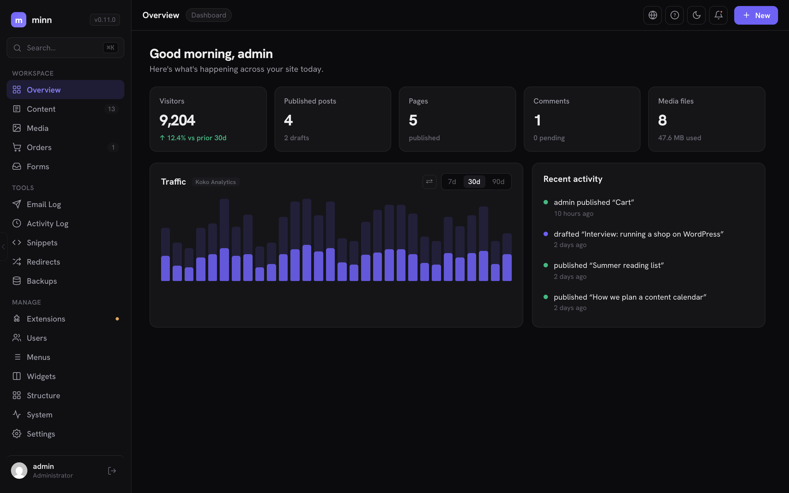

# Minn Admin

**A reimagined WordPress admin experience — fast, focused and beautiful.**

Minn Admin serves a modern, minimal dashboard at `/minn-admin/` on your WordPress site. It's a
single-page app built on the WordPress REST API — no React, no build step, one vanilla-JS file —
and it lives *alongside* the classic wp-admin, which stays fully available.

## Features

- **Overview** — stat cards, a real **Traffic chart** with hover details when an analytics plugin
  is installed (Koko Analytics, WP Statistics, Burst, Independent Analytics), and a
  recent-activity feed
- **Content** — posts, pages and custom post types with search, status pills and pagination
- **Media** — grid/list library, uploads, drag-and-drop, and a preview overlay with arrow-key navigation
- **Comments** — full moderation (pending / approved / spam / trash)
- **Orders** — WooCommerce orders with summary cards and line-item detail (when WooCommerce is active)
- **Users** — directory with search, create/edit users, roles, passwords, and **per-user login
  sessions with one-click sign-out**
- **AI Access** — generate revocable **application passwords** for AI agents plus a site-tailored
  **agent guide** (markdown REST reference) to hand to a coding agent; configuration work stays
  out of Minn by design
- **Extensions** — install plugins and themes from WordPress.org or zip upload, activate,
  deactivate, delete, per-item and bulk updates, and a Themes tab with screenshots
- **Settings** — General (with timezone picker), Writing, Reading and Discussion, plus built-in
  maintenance mode
- **Editor** — distraction-free, block-aware writing surface: native Gutenberg markup with
  complex blocks preserved byte-for-byte as **read-only islands**, slash commands, tables,
  syntax-highlighted code blocks with a language picker, featured images, image insertion,
  categories, revisions with restore, autosave, scheduling and one-click publish
- **Command palette** — ⌘K / Ctrl-K everywhere
- **Plugin surfaces** — bundled adapters for **Gravity Forms** (entries), **Gravity SMTP**
  (email log), **Simple History** (activity log), **Redirection** (redirects) and **ACF**
  (editor panels), plus one-filter APIs for any plugin to register views, editor panels or
  traffic data
- **Dark & light themes**, bundled fonts, zero external requests from the app

## Install

1. Download or clone into `wp-content/plugins/minn-admin`.
2. Activate through the Plugins screen.
3. Visit `/minn-admin/` — also linked from the admin bar and the wp-admin menu.

Pretty permalinks recommended (clean routes like `/minn-admin/content`); without them the app
falls back to `/?minn_admin=1` with hash routing. Updates are delivered through the normal
WordPress updates UI via GitHub Releases.

## Extending

Any plugin can add a view to Minn with one filter — a declarative descriptor, no JavaScript
required. See [docs/for-plugin-authors.md](docs/for-plugin-authors.md), and
[docs/extension-api.md](docs/extension-api.md) for the design rationale.

## Documentation

- [Project goals](docs/goals.md)
- [Editor direction](docs/editor-direction.md)
- [For plugin authors](docs/for-plugin-authors.md)
- [Changelog](changelog.md)

## Development

Edit and go — there's no build step. Lint with `node --check assets/js/app.js` and
`php -l minn-admin.php`. Commit messages follow [Emoji-Log](https://github.com/ahmadawais/Emoji-Log).

## License

[MIT](LICENSE) © [Austin Ginder](https://austinginder.com)
