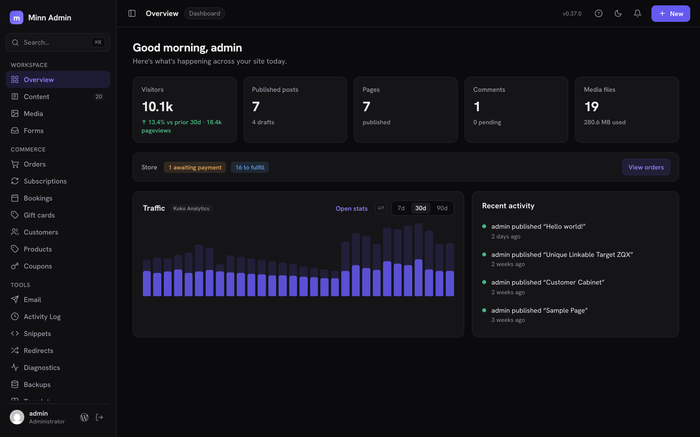

# Minn Admin

**A reimagined WordPress admin experience. Fast, focused and beautiful.**

Minn Admin serves a modern, minimal dashboard at `/minn-admin/` on your WordPress site. It's a
single-page app built on the WordPress REST API with no React, no build step, and one
vanilla-JS file. It lives *alongside* the classic wp-admin, which stays fully available.

**Website:** [minnadmin.com](https://minnadmin.com) · [User guide](https://minnadmin.com/docs/user-guide/) · [FAQ](https://minnadmin.com/#faq) · [Security](https://minnadmin.com/#security) · [Roadmap](https://minnadmin.com/docs/roadmap/)

<!--
  The badge/launch link above goes through https://minnadmin.com/playground, a redirect to
  WordPress Playground with ?blueprint-url= pointing at this repo's .wp-playground/blueprint.json
  on the main branch. blueprint.json is the single source of truth: edit it, push, and the demo
  picks the change up within raw.githubusercontent's cache window (about five minutes). Nothing
  here needs regenerating.
-->

## Install

1. Download or clone into `wp-content/plugins/minn-admin`.
2. Activate through the Plugins screen.
3. Visit `/minn-admin/`. It is also linked from the admin bar and the wp-admin menu.

Pretty permalinks are recommended for clean routes such as `/minn-admin/content`. Without
them, Minn falls back to `/?minn_admin=1` with hash routing. Updates arrive through the
normal WordPress updates screen from GitHub Releases.

## What you can do

- **Run the site:** Manage content, media, comments, users, settings, and WooCommerce from
  one focused interface.
- **Write with confidence:** Keep native Gutenberg content while gaining autosave, revision
  diffs, post locking, recovery, and distraction-free writing tools.
- **Work with your plugins:** Bring forms, backups, email logs, redirects, snippets,
  analytics, licenses, and other daily workflows into consistent Minn surfaces.
- **Care for the site:** Handle updates, diagnostics, logs, visibility warnings, backups,
  security posture, and cache controls without hunting through plugin menus.
- **Stay in control:** Classic wp-admin remains available, builder-owned content stays
  protected, and integrations never inject third-party interfaces into Minn.
- **Use it your way:** Minn works on phones, supports multisite and twenty-four languages,
  and includes dark, light, System, and custom per-user color schemes.

For a task-based walkthrough, read [Using Minn Admin](docs/user-guide.md). For exact plugin
coverage, see the [plugin compatibility map](docs/plugin-support.md).

## Full feature reference

Expand only the part of Minn you want to explore.

<strong>Daily site work</strong>

- **Overview** — stat cards, a real **Traffic chart** with hover details when an analytics plugin
  is installed (Koko Analytics, WP Statistics, Burst, Independent Analytics, AnalyticsWP,
  **Plausible Analytics**, **Matomo**, Google Analytics through **Site Kit**, or **Jetpack Stats**), **click a bar for
  that day's top pages and referrers** (Koko, WP Statistics, Burst, Independent Analytics,
  Plausible Analytics, Matomo and Jetpack Stats today; others join via `minn_admin_traffic_day`) and step through
  days with the arrow keys, plus a recent-activity feed. **Open stats** (also a palette command)
  opens a dedicated page for longer history: ranges up to twelve months, a custom window
  inside the last year, and range-wide breakdowns (top pages and referrers everywhere;
  countries, devices and search terms where the provider tracks them)
- **Content** — posts, pages and custom post types sorted by publish date (scheduled posts
  lead with their go-out dates), with search, category/tag filters, status pills (live posts
  carrying unsaved edits wear a **Modified** chip, with a matching filter; a post someone
  else has open says who is editing), **bulk
  actions** (set status or trash, with shift-click range select), and **row actions**:
  right-click or hover for quick publish/draft/trash, view, and a block-editor escape
- **Media** — grid/list library, uploads, drag-and-drop, a preview overlay with arrow-key
  navigation and in-place **title, alt text, caption & description editing**, **bulk select
  and delete** (shift-range, on the grid and the list), a right-click menu, and a built-in
  **image editor** (rotate and crop, saved as a new copy). **Folders** arrive from your folder
  plugin (FileBird, Real Media Library, Folders by Premio or HappyFiles Pro) with a **Move to
  folder** bulk action through each plugin's own machinery; an **Unattached** filter and a **month picker**
  cover the daily cleanup questions; every file's detail names the post it is **attached to**,
  one click from that post's editor; **Replace file** works in place through Enable Media
  Replace; the **SVG** filter tab appears with Safe SVG or SVG Support active, and
  **↻ Thumbnails** works through Regenerate Thumbnails or Force Regenerate Thumbnails
- **Comments** — full moderation (pending / approved / spam / trash) with **bulk moderation**
  (each tab offers its own verbs), inline replies, in-place comment editing, **Block
  commenter** (core's disallowed list, with Undo) and a right-click menu for the same verbs
- **Ecommerce** — full WooCommerce day-to-day in Minn: **Orders** open as full pages (linkable,
  refreshable, with a **Quick view** modal from the list) with search, status, notes, a **Payment
  card** that records hand-received payments through WooCommerce's own machinery, **itemized
  refunds** with quantity steppers and restocking, resend/custom email, pay URL, **New order**,
  **Analytics** with long-range revenue and top products, and a Store strip on the Overview naming
  the orders that need work today.
  **Products** open as full pages as well, in the order page's shape: a main column for what the
  product is (pricing with its sale schedule and tax class, inventory down to GTIN and backorders,
  shipping, the image and gallery as tiles you drag to reorder, attributes, and variations a variable
  product can generate from its own attributes, each one a row that opens its own editor) and a
  sidebar for what it is filed under (status, type, categories, tags and brands as checkable lists
  you can add to, upsells and cross-sells), with a save bar that offers Discard beside Save and the
  long description in Minn's own editor. The products list carries stock filters, bulk actions and
  **Add product**. The orders list filters the way a storefront back
  office does: a status view, search and **Add filter** in one row, active filters as removable
  chips, multi-status, date window, customer and product all narrowing on the server, and the
  whole set living in the URL so a filtered list can be pasted to someone else. Orders can
  **apply and remove coupons**, and an order that belongs to a subscription carries a badge that
  opens its summary. **Coupons**, **Customers**, and **Subscriptions** when WooCommerce
  Subscriptions is active: a subscription opens on its own page in the order page's shape, with
  editable items and schedule, coupons, a notes timeline, a quick view of related orders, and
  the same filter bar with its own status vocabulary. **Memberships** when WooCommerce
  Memberships is active: members with the same filter bar, a status card and fourteen-day chart,
  pause, resume, cancel, end dates, notes, transfers and Add member, each membership and each
  plan on a page of its own (plan rules and discounts as plain lists), and a subscription link.
  Products and coupons wear that same orders filter bar (status as the dropdown; stock,
  category, tag, type, featured and on sale on products; a date window on coupons).
  **Gift cards** when YITH, official WooCommerce Gift Cards, or PW Gift Cards is active:
  one Commerce item with a provider switcher, the outstanding balance the store still
  owes, enable/disable, change the balance, resend, and Add gift card.
  Orders, products and customers carry **right-click menus** for
  the common moves (status changes, stock and publish toggles, email, jump to a customer's orders).
  Invoice / packing-slip downloads when PDF Invoices & Packing Slips is active. Product, coupon and
  subscription CPTs are fenced out of Content.
- **Users** — directory with search, a role filter, create/edit users, roles, passwords,
  **bulk role change**, **per-user login sessions with one-click sign-out**, **Switch to
  this user** when the User Switching plugin is active (a switched session shows a **Switch
  back** bar in Minn), and **Copy one-time login link** when One Time Login is active.
  Editing a user is a **full page at `/minn-admin/users/{id}`**: identity, public profile,
  language, sessions, plus the user's **Minn appearance set by an admin** (color scheme
  including custom palettes, default admin, toolbar) so a client's Minn looks right before
  their first sign-in, and a **Hidden for them** card restoring anything they hid.
  Administrators also get **Role defaults**: per role, choose what happens after sign-in
  and which toolbar that role gets on the public site, as an overlay that never erases
  anyone's saved preference
- **Multisite** — fuzzy-search the sites you can use from a compact sidebar switcher or
  the command palette;
  subsite administrators can add existing network accounts, change roles, and remove site
  memberships. Network administrators get first-class **Sites**, **Network users**, and
  **Network settings** surfaces, plus network-wide plugin activation, theme availability,
  and post-core-update database migrations. With WP Multi Network active, a **Networks**
  surface lists every network, creates networks with root sites, moves sites between them,
  and safely deletes non-primary networks. Main/current-site, self-lockout, and last-admin
  guards protect destructive actions; account creation/deletion, network domain and path
  changes, the long settings tail, and very large network upgrades link to WordPress Network Admin
- **Multi-tenant** — on a WP Freighter host, a **Tenants** group lists every tenant site
  with its domain, accounts and whether Minn runs there; create, rename, clone, delete
  and turn Minn on or off per tenant through WP Freighter's own API, edit its files mode
  and domain mapping, and hop between the main site and any tenant from the site switcher
  or the palette through WP Freighter's one-time sign-in
- **In your language** — the whole interface follows the language you pick, per user, in
  **twenty-four languages** covering about half of WordPress installs. Right-to-left languages
  (Arabic, Hebrew, Persian and friends) get a genuinely mirrored layout, counts follow each
  language's own plural rules, and translations arrive as **WordPress language packs** through
  the same Updates screen as everything else. **Extensions → Translations** lists every
  language whose files are on the site, not only the ones waiting to update, and can
  **remove** a language nothing uses so WordPress stops keeping it current forever
- **Your profile** — a full page at `/minn-admin/profile`: account, public profile (first/last
  name, website, bio, Gravatar), **per-user language** with automatic pack installs, the
  front-end toolbar preference, appearance, hidden integrations, and login sessions
- **AI Access** — generate revocable **application passwords** for AI agents plus a site-tailored
  **agent guide** (markdown REST reference) to hand to a coding agent; configuration work stays
  out of Minn by design

<strong>Extensions, structure, and settings</strong>

- **Extensions** — install plugins and themes from WordPress.org or zip upload (Add plugin opens a
  **catalog by category** with install tips, not only free-text search), activate, deactivate,
  delete, per-item and bulk updates with **Queued… / Updating…** feedback that survives worker
  recycles, a Themes tab with screenshots, cards wearing real wp.org icons (linked to the
  directory) with linked author lines, **per-item auto-update toggles** on every plugin and
  theme card (core's own `auto_update_*` lists, so Minn and wp-admin always agree), **Live
  preview** on inactive themes (Customizer for classic themes, Site Editor preview for block
  themes), **right-click menus** on plugin and theme cards
  (Activate, Update, Delete, Open on WordPress.org or GitHub, Copy file), a **Translations**
  tab that lists every installed language and can remove one nothing uses, and a
  **Licenses** tab (below)
- **Structure** — post types, taxonomies and terms on one page. See every registered post type
  and taxonomy and manage definitions through whoever owns them (ACF, Custom Post Type UI, or
  Minn's own store when neither is active; code-registered ones shown read-only), and a full
  **terms manager**: rename, re-parent, **merge** (posts move to the survivor through core's own
  reassignment) and delete across every taxonomy, with an indented tree for hierarchical ones.
  Post type and taxonomy rows answer a **right-click** (open the definition, jump to that
  type's content, start a new item, manage terms, or remove an editable definition)
- **Settings** — reorganized by intent: **Site** (identity, logo, site language, locale, admin, with timezone picker),
  **Visibility** (search engines, maintenance mode, membership), **Homepage**, **Content**
  (new-content defaults + permalinks with automatic rewrite flushing), **Comments** (discussion +
  spam), **Design** (the Customizer's Additional CSS, validated before saving) and
  **Connectors** (WP 7.0's registry of AI providers and external services: connection state,
  where each key comes from (saved, wp-config constant or environment variable), install the
  companion plugin in place, keys saved through core's own masked route), under a sticky
  section nav. The **Spam** page shows who filters comment spam (Akismet, Antispam Bee,
  CleanTalk, WP Armour) with safe toggles and blocked counts. **Site-visibility warnings**: an
  Overview banner and a persistent topbar chip appear whenever a maintenance plugin, password
  gate or "discourage search engines" is hiding the site, with inline fix controls where Minn
  can safely flip the setting, including **turn-off switches with Undo** for detected
  coming-soon and maintenance plugins that write through each plugin's own storage (third
  parties register via `minn_admin_visibility_providers` and `minn_admin_visibility_toggles`)

<strong>Writing and page building</strong>

- **Editor** — a calm, block-aware writing surface that stores **native Gutenberg markup**
  (zero lock-in: open any post in the block editor, any time). Markdown typing conventions
  (`**bold**`, `` `code` ``, `## headings`, lists, quotes, fences, dividers…), with wraps
  that stay on the undo stack (including inline code). **Every core layout container is a
  writing surface**: Group, Columns, Cover and Media & Text open for typing, nested to any
  depth, with markdown, the slash menu, the block picker and rich paste all working inside
  and each column its own side-by-side surface; container framing and styling re-save
  **byte-for-byte**, so the block editor always reopens the layout cleanly. Complex blocks
  (a spacer, a buttons row, a plugin's block) stay preserved byte-for-byte as
  **configurable islands** with real front-end styles, right where they live, with
  **duplicate and move arrows** in the ⚙ popover (left/right hops between columns) and
  in-place text editing. **Pasting raw block markup** (from an AI tool or a pattern file)
  converts to real blocks instantly. WordPress's own dynamic blocks insert from the slash
  menu too: the **Query Loop** (post type, ordering, count and more editable from the ⚙
  gear), the **widget blocks** (Latest Posts, Archives, Calendar, Search…), and **Tabs and
  Accordion** with starter sections, all saved as exactly the markup the block editor
  produces. Link popover on ⌘K, text alignment,
  table and image controls in island-style cutouts, at the top level and inside
  containers. Slash commands stay curated and type-to-filter; **Browse all** or **⌘/**
  opens the **block picker**, grouped by source (basics, plugin blocks, design libraries,
  patterns). Plugins can register free-form slash items through
  **`minn_admin_editor_commands`** (boilerplate HTML, island templates, or an async REST
  route). **Dynamic third-party blocks** that render standalone auto-appear in search (no
  adapter); **Stackable**, **Kadence**, and **GenerateBlocks** free design/pattern libraries
  insert as valid Gutenberg markup with images sideloaded; **block patterns** from core, the
  theme, and plugins join the same search, and so do **your own saved patterns**: synced ones
  insert as live `wp:block` references that follow later edits, unsynced ones as detached
  copies, with a Patterns entry in Content to manage them. Island content is editable: **text runs** and an
  **Images** section rewrite only what you change; block settings scale (used fields first,
  the rest behind **More settings**); every island links out to the block editor for layout
  controls. **Gallery-shaped blocks** (core galleries, sliders and carousels, fixed layouts,
  Jetpack's tiled gallery) open an **images editor**: reorder, replace, add, remove, duplicate
  and caption photos, each moved as an exact unit, with dropped files uploading into the block
  and gallery **columns, crop and random order** editable from the ⚙ popover. **Multi-block
  containers** open an **Edit content** window: one card per block, text first, other settings
  tucked behind a toggle. Previews pick up lazy CSS, layout-support CSS (gallery columns,
  group gaps) and **auto-warm** browser-compiled styles when needed.
  Syntax-highlighted code blocks; **writing stats** on the sticky pill (words, reading time,
  session delta, optional word goal); scheduling and one-click publish. **Paste cleanup**
  turns Word / Google Docs / web HTML into the safe subset; **paste or drag an image**
  uploads at the caret with an inline caption. The publish sidebar edits the **slug**,
  **visibility** (a themed Public / Password / Private combobox), per-post **discussion**,
  **sticky** and **post format** (when the theme supports formats). Deleting an embed offers
  an **Undo** toast; **table** add/delete row and column undo with **⌘Z**. **Revision diffs**
  open a side-by-side, word-marked diff against the current content. An **outline panel**
  lists headings as a live table of contents; **focus mode** (⌘⇧D) fades all but the current
  paragraph; **outline mode** (⌘⇧O) leaves just the writing and the outline. The **internal
  link picker** searches your own posts from the link popover, and a themed **date-time
  picker** handles scheduling. **Find & replace** (⌘⇧F) matches across inline formatting,
  never touches protected islands, and every replace is a native undo step. Built for real
  writing sessions: **IME-safe** composition (CJK and dead keys), **mobile Safari** keyboard
  and hit-target polish, and a first-cut **accessible** toolbar, slash menu, and block
  popovers. ⌘⏎ publishes; the help dialog documents every shortcut.
  Where this is heading: [the editor roadmap](docs/editor-roadmap.md)
- **Never lose work** — post locking on WordPress's own `_edit_lock` (Minn, the classic editor
  and Gutenberg all honor each other, with takeover), plus a localStorage **crash net** that
  snapshots every edit within ~1.2s (before the first autosave) and offers recovery on the
  next open. Status-aware autosave: drafts save in place, published posts back up to revisions
  (only Update goes live), with a backup-restore banner.
- **Page builders** — build a page with **Divi, Elementor, Brizy, Beaver Builder, Etch, Bricks,
  Breakdance or WPBakery** and keep managing it from Minn: builder-owned pages are marked, edited through
  the builder's own chrome-free surface via **Edit in ⟨builder⟩** (no wp-admin screen), and
  fenced so a stray Minn edit can't break the builder's canvas. + New can start a page in any
  active builder. **Bricks and Elementor templates** get a Templates surface: list by type,
  rename, duplicate, export, tag, create, and jump into the builder, all through each
  builder's own permissions. Third parties register via the `minn_admin_page_builders` filter

<strong>Site care and plugin workflows</strong>

- **System** — a developer diagnostics page with a sticky section **jump bar**: a health strip
  over WordPress / PHP / database / server facts, plus **loopback and REST self-checks**, site
  visibility, **Wordfence firewall & scan posture**, **SSL enforcement** (Really Simple SSL),
  backups and licenses; the **autoloaded-options breakdown** and **cron health** expand into
  full-detail modals (every option by size, every scheduled event with its next run); the real
  login URL (honoring login-hiders), an **installed extensions manifest**, a **Tools card**
  linking wp-admin's one-shot jobs (Site Health, export/import, GDPR tools), live **debug
  toggles** that safely rewrite `wp-config.php`, a multi-source **log viewer** (debug log, PHP error log and every WooCommerce log channel, with a collapse-repeats mode), and one-click
  **Copy report** as markdown
- **Licenses** — a license manager on **Extensions → Licenses**, beside the plugins and themes
  it describes: every paid product classified **valid / expired / invalid / missing** from the
  vendor's own locally stored state (read-only: no network calls, no seat burn), grouped by
  state with inactive components collapsed, with **paste-to-activate, deactivate and
  re-verify** wired through each
  vendor's own code for more than twenty vendors (Elementor Pro, ACF PRO, WP Rocket, Gravity
  Forms & SMTP, WPForms Pro, Breakdance Pro, Divi, Beaver Builder, Brizy, Etch, Bricks, The Events Calendar family, Kadence
  Blocks Pro, WPMU DEV, SearchWP, Gravity Perks, GP Premium, Perfmatters, WP All Import/Export,
  Slider Revolution, LayerSlider), plus generic Freemius / EDD / SureCart / StellarWP detection.
  Service keys and account connections ride the same card with a chip saying which they are:
  Akismet's key (also editable in place on the spam card), the **WooCommerce.com, Site Kit and
  Jetpack connections** as read-only rows with a Connect link when absent, and the AI connector
  keys WordPress core manages, one doorway from Settings → Connectors.
  A pasted key rides one request and is never stored or logged; failures never auto-retry;
  inactive components can be turned back on in place. Third parties register via
  `minn_admin_license_providers`
- **Editor field panels** — **ACF** fields edit in full: every applying field group renders
  with no "Show in REST API" setting required, covering text, choices, switches, checkboxes,
  color, image, gallery, file, date and time, rich text, the relational pickers (Post Object,
  Relationship, Page Link, Taxonomy, User), **repeaters as row cards** and **flexible content
  as sections**, with ACF's conditional logic honored live and unrendered values preserved
  through every edit; **Meta Box** and **Pods** simple fields ride the same panel (their
  advanced types count as locked with a wp-admin link); **SEO panel** at full per-post depth for Yoast SEO, Rank Math,
  All in One SEO, SEOPress, SiteSEO, SureRank or Squirrly (first active SEO plugin wins): a
  live search-result preview with length counters, title, meta description and focus keyword,
  robots directives, canonical URL, the Facebook and X cards with images, and each plugin's
  extras such as cornerstone or pillar content, every write through the plugin's own storage
  and every field behind the plugin's own permissions; **Event details** for The Events Calendar (dates, all-day, venue and
  organizer as live search pickers, cost, website); **Job listing** for WP Job Manager, drawn
  live from its own field schema; **Podcast episode** for Seriously Simple Podcasting and
  PowerPress (media file, duration, the Apple Podcasts fields). Every write goes through the
  owning plugin's own save machinery
- **ACF schema and options** — a **Field Groups** manager plus a full **builder page** per
  group: stack fields, configure inline, drag to reorder, duplicate, a repeater sub-field
  builder, and **location rules** edited as readable sentences over the site's real post
  types, templates and roles; **import and export** in ACF's own Tools JSON with imports that
  update an existing group in place; **options pages** merged under one **Site Options**
  sidebar entry with their tabs intact; and **ACF blocks** exposing their real fields in the
  block inspector (the `dataForm` descriptor, open to any plugin with the same shape)
- **Menus & Widgets** — classic nav menus with drag-to-reorder (children travel with their
  parent) and right-click menus on every item; classic sidebars with **drag grips** to reorder widgets in an area, plus move
  between areas and in-place edit for block/text/HTML widgets
- **Design** (block themes) — the three things the Site Editor keeps behind its own canvas, on
  one screen. **Templates** sorts the ones this site changed to the top and says which is which
  (from the theme, customized here, added here, plugin-registered), counts **what actually uses
  each one**, resets a customized template to the theme's file, and opens any of them in Minn's
  own editor with the byte-for-byte guarantee the rest of the editor makes, **History**
  included once the site has its own copy: every saved version, who saved it, a side-by-side
  read against what is on screen, and one click to restore. **Template parts**
  get their own tab with the count of templates that include them. **Navigation** lists a block
  theme's menus with **where each one renders** and arranges the items in place: rename,
  re-point, drag to reorder, indent to build a dropdown, add a page or custom link, remove with
  Undo. **Styles** shows the theme's style variations as swatch cards built from each one's own
  palette, applies one with a real Undo, and says plainly when a site cannot store them
- **Crocoblock** — the Jet pack's daily work, each surface over the plugin's own tables and
  code: **JetEngine** meta boxes as an editor **Custom fields** panel, its options pages as
  **Site options** tabs, and its post types and taxonomies on **Structure**; **JetBooking** and
  **JetAppointments** in the **Bookings** inbox; **Custom Content Types** as a **Content types**
  surface with a view per type; **JetReviews** as a **Reviews** inbox with per-field ratings and
  bulk approve; **JetThemeCore** parts on **Templates** beside Elementor and Bricks;
  **JetSearch** suggestions and **JetSmartFilters** filters sharing one **Search** item, its
  indexer reindexing as a background job. One **Crocoblock** membership key on Licenses covers
  every installed Jet plugin
- **Surfaces** — Minn's answer to plugin sprawl: one sidebar item per *job*, not per plugin,
  with every capable plugin layered in behind it and a provider switcher when more than one is
  active. **Forms** (Gravity Forms, WPForms, Ninja Forms, Fluent Forms, Forminator, Formidable, Everest
  Forms, SureForms, Elementor Pro, Contact Form 7 via Flamingo or CFDB7) shows entries as
  contact cards with real field labels and ←/→ stepping, with the full **Gravity Forms
  workflow** inside Minn: star, spam, trash, restore, **bulk actions**, notes and resent
  notifications across Received / Spam / Trash views, plus a **Feeds** view listing every
  add-on integration across your forms (Everest Forms carries the same three status views
  through its own entry helpers);
  **Bookings** (Amelia, LatePoint, Bookly, JetBooking, JetAppointments) lists upcoming
  appointments with pending / today / canceled
  filters, a contact card, a **Next 14 days** chart, and approve / cancel / no-show through
  the plugin so its notifications still fire;
  **Email** (Gravity SMTP, FluentSMTP, WP Mail SMTP, Post SMTP, WP Mail Logging, SureMails,
  Site Mailer) shows sent mail with the real HTML body in a **fully sandboxed preview**,
  resend, and search plus delete where the logger supports it, plus Gravity SMTP's **full
  settings** (all 21 connectors, drawn at runtime from its own schema), suppressions,
  **send a test email**, and a **FluentSMTP Settings view** for the day-to-day choices
  (on FluentSMTP 2.3+ resends ride its own machinery with a logged trail, **Resend to…**
  retargets a message, and its daily connection check surfaces on the status card and
  System health);
  **Activity Log** (Simple History, WP Activity Log, Aryo, Stream, All-In-One Security,
  Wordfence login security, plus **Limit Login Attempts Reloaded** and **Solid Security**
  lockouts with unlock/release actions) reads like an audit feed; **Redirects** (Redirection,
  Safe Redirect Manager, Simple 301 Redirects, 301 Redirects) lists, searches, creates and
  edits, with **sortable columns** on Redirection; **Snippets** (Code
  Snippets, WPCode, FluentSnippets, Simple Custom CSS and JS, Header Footer Code Manager) lists,
  toggles, creates and bulk-edits; **Performance** (Perfmatters, Autoptimize, Asset CleanUp,
  Performance Lab) shares one Tools item with a provider switcher; **Backups**
  (UpdraftPlus, WPvivid, BackWPup, All-in-One WP Migration, Duplicator, Disembark) below.
  **Status cards** now open the whole mail, redirects and snippets families, and detail modals
  render **typed rows**: status pills, code blocks, key-value tables and sandboxed HTML
  previews. Surface lists open a **⋯ / right-click** menu of that collection's actions. Plugins that need
  their own first-run install get a **setup card** that runs their installer in place. The sidebar
  organizes into **Workspace / Tools / Manage** groups so daily inboxes stay separate from site plumbing,
  and **admin menus a developer removed with `remove_menu_page` stay hidden in Minn too**
  (cosmetic like the original; opt out with `minn_admin_respect_removed_menus`)
- **Backups** — with **UpdraftPlus** or **WPvivid**: sets listed, status cards, a System health
  check answering "is my site backed up?", and **Back up site now** from ⌘K. With **BackWPup**:
  local folder archives and run-now. With **All-in-One WP Migration**: local `.wpress` exports
  with delete. With **Duplicator**: packages with archive sizes read from disk and delete through
  its own cleanup. With **Disembark**: a status card (last scan, database size, working files),
  the exact `disembark connect` command click-to-copy, scan sessions with cleanup, and token
  regeneration. Backups and exports **run as background jobs** on UpdraftPlus, WPvivid, BackWPup,
  Duplicator and All-in-One WP Migration: a **progress pill** in the topbar carries the live step
  and percent on every route, a modal offers Stop through the plugin's own abort, and the job
  survives a reload. Every finished row carries **Download**, streamed from the plugin's own
  backup folder through a nonce-checked `admin-post` door, so nothing has to be web-readable

<strong>Control and extensibility</strong>

- **Notifications that respect you** — comments, plugin/theme/core updates and new users in one
  panel, plus an **admin-notice digest**: the notices other plugins print in wp-admin are
  extracted as structured data (never their HTML or JavaScript) into a Notices tab; **Allow /
  No Thanks** and ThemeIsle-style dismiss links run in the background (not a new wp-admin tab),
  and any notice can be hidden with Undo. Each update offer has its own **Update → version**
  button; the Updates tab also pins **Update everything** (plugins, themes and core in one
  click, poll-verified core). A pending WordPress update also shows as an amber topbar chip and
  Overview banner
- **Command palette** — ⌘K / Ctrl-K everywhere, and it **finds your content**: type anything to
  see your posts, pages and CPTs (drafts and scheduled included) under the command matches, and
  Enter opens the Minn editor. Site-care actions built in: **Clear site cache** purges every
  layer the site runs (Kinsta, LiteSpeed, WP Super Cache, W3TC, WP Rocket, WP Fastest Cache,
  SiteGround, Autoptimize, WP-Optimize, Cache Enabler, Hummingbird, Elementor CSS, SpeedyCache,
  Redis Object Cache, Breeze, Nginx Helper, Cloudflare), each in its own isolated request
- **Extending** — one-filter APIs for any plugin to register views (with status cards and optional
  **charts**, extra **list views**, tabs, status filters, **sortable columns**, detail layouts
  with **typed rows** including sandboxed HTML previews, actions with inline
  fields, **bulk actions**, schema-driven **settings views** including **item-scoped settings**,
  and **setup gates**), editor panels (including async **search-picker** fields), **editor slash
  commands**, traffic data (including
  per-day drill-down), **media folder providers**, cache purgers, spam providers, license providers, visibility providers,
  design libraries, page builders or block-inspector forms; the System page's **Integrations**
  card shows everything registered and flags descriptor problems instead of failing silently.
  The full coverage map lives in [docs/plugin-support.md](docs/plugin-support.md)
- **Quiet by architecture** — integrations are data, never third-party HTML or scripts, and
  attention is budgeted: one plugin holds at most three nav slots and three default slash
  entries (overflow stays one search away), Workspace placement requires an inbox-shaped view,
  **off-site links always carry the ↗ mark**, and every surface, editor panel, design library,
  slash namespace **and core menu item** can be **hidden per user** from Minn's own UI
  (restore from Your profile, or an admin restores for you from the Users page), with no API
  for a plugin to detect or resist it
- **Dark, light and System themes** (follows your OS until you choose; right-click for an
  explicit menu) plus **per-user color schemes**: named light/dark presets or a fully custom
  scheme with per-slot color pickers, set on Your profile. Bundled fonts, zero external
  requests from the app, responsive down to phones

## Extending

Any plugin can add a view to Minn with one filter: a declarative descriptor, no JavaScript
required. Start with [docs/for-plugin-authors.md](docs/for-plugin-authors.md); it opens with
a quick start and carries a screenshot of every primitive. If your data lives in a custom
table, [docs/shim-tutorial.md](docs/shim-tutorial.md) walks the whole build with a copyable
example plugin, and the WordPress Playground demo boots that example preactivated so a
working instance of the API is one click away.

## Documentation

- [Using Minn Admin](docs/user-guide.md) (the site-owner guide: getting around, writing, staying in control, safety)
- [Project goals](docs/goals.md)
- [Editor direction](docs/editor-direction.md)
- [Editor roadmap](docs/editor-roadmap.md)
- [Block inspector](docs/block-inspector.md)
- [Block-suite lab notes](docs/block-suites.md)
- [For plugin authors](docs/for-plugin-authors.md)
- [Security policy](security.md)
- [Changelog](changelog.md)

## Development

Edit and go. There's no build step. Lint with `node --check assets/js/app.js` and
`php -l minn-admin.php`. Commit messages follow [Emoji-Log](https://github.com/ahmadawais/Emoji-Log).

## License

[MIT](license) © [Austin Ginder](https://austinginder.com)

Bundled Hanken Grotesk and JetBrains Mono are SIL OFL 1.1. See
[assets/fonts/](assets/fonts/).
